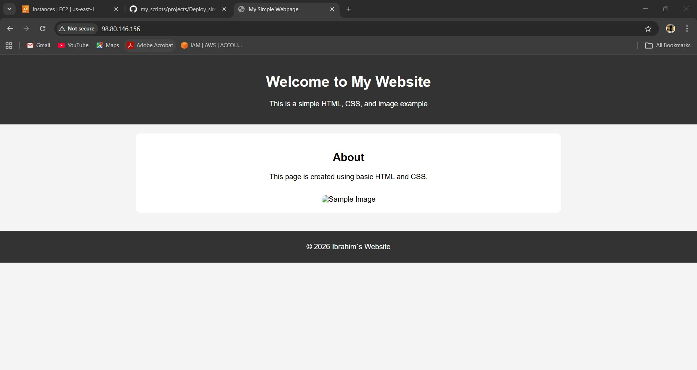

# 🚀 Ansible-Based Web Server Deployment on AWS EC2

## 📌 Project Overview

This project demonstrates a **production-oriented infrastructure automation workflow** using **Ansible** to provision and configure a web server environment on AWS.

The objective is to implement a **modular, role-based architecture** that separates concerns between system preparation, web server configuration, and application deployment.

---

## 🏗️ Architecture Summary

The deployment follows a simple and clean 2-tier model:

```
Client → Nginx (Web Server) → Static Frontend Application
```

Automation is handled entirely using **Ansible roles**, ensuring reusability, scalability, and maintainability.

---

## ⚙️ 1. EC2 Provisioning and Requirements

An EC2 instance was created to serve as the target host for deployment. The following configurations were applied:

### 🔹 Instance Configuration

* OS: Ubuntu (recommended LTS version)
* Instance type: Suitable for testing (e.g., t2.micro)
* Key pair: Configured for secure SSH access

### 🔹 Network & Security

* Security Group rules:

  * Allow **SSH (port 22)** from trusted IP
  * Allow **HTTP (port 80)** from all (0.0.0.0/0)
* Internet Gateway attached for public access

### 🔹 Access Setup

* SSH connectivity verified using private key
* Ansible inventory configured with:

  * Remote user
  * Private key authentication

---

## 🧩 2. Ansible Roles Design

The project is structured using **three main roles**, each with a clear responsibility following best practices.

---

### 🔹 2.1 Base Role (System Preparation)

Responsible for preparing the target system with essential dependencies.

#### Key Tasks:

* Update package cache
* Install required system packages
* Perform initial system setup

#### Purpose:

Provides a **clean and consistent baseline** for all other roles.

---

### 🔹 2.2 Nginx Role (Web Server Setup)

Handles installation and configuration of the web server.

#### Key Tasks:

* Install Nginx using package manager
* Configure Nginx service
* Deploy configuration templates
* Enable and start the service
* Use handlers to reload/restart Nginx on changes

#### Outcome:

A fully functional and properly configured web server ready to serve content.

---

### 🔹 2.3 App Role (Frontend Deployment)

Responsible for deploying the frontend application.

#### Key Tasks:

* Clone the application repository from a remote source
* Extract or select the required application files
* Copy files into the Nginx web root directory (`/var/www/`app)
* Set appropriate ownership and permissions
* Trigger Nginx reload when content changes

#### Outcome:

The frontend application becomes accessible through the web server.

---

## 📂 Project Structure

```
ansible-project/
├── inventories/
│   └── inventory
├── roles/
│   ├── base/
│   ├── nginx/
│   └── app/
├── playbooks/
│   └── playbook.yml
├── ansible.cfg
```

---

## ▶️ Execution

Run the deployment using:

```bash
ansible-playbook -i inventories/inventory playbooks/playbook.yml
```

---

## ✅ Validation & Testing

After deployment:

* Verify Nginx is running:

  ```bash
  systemctl status nginx
  ```

* Test locally on the server:

  ```bash
  curl localhost
  ```

* Test externally:

  ```
  http://<EC2_PUBLIC_IP>
  ```

Expected result:
The frontend application is successfully served via the web browser as shown below.

### 📸 Final Result

> 

---

## 💡 Key Highlights

* Modular **role-based design**
* Idempotent and repeatable automation
* Clear separation of concerns:

  * System setup
  * Web server configuration
  * Application deployment
* Production-aligned practices (handlers, templating, structured roles)

---

## 🔮 Future Improvements

* Add HTTPS using Let's Encrypt
* Introduce CI/CD pipeline (e.g., Jenkins)
* Implement environment separation (dev/staging/prod)
* Enhance deployment with zero-downtime strategies
* Containerize application using Docker

---

## 📎 Conclusion

This project demonstrates a solid foundation in **DevOps practices**, particularly in:

* Infrastructure automation with Ansible
* Role-based architecture design
* Cloud deployment on AWS

It reflects a practical approach to building **scalable and maintainable deployment pipelines**.

---
